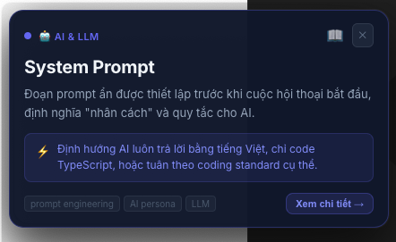
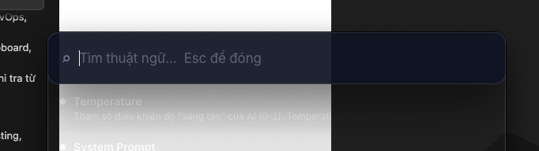
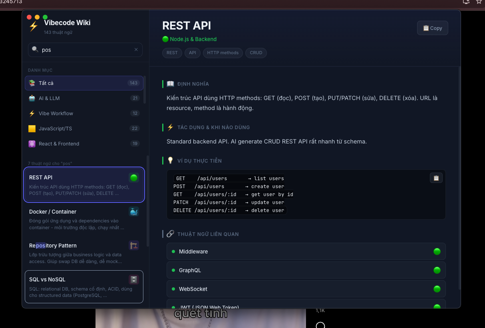

<div align="center">

# ⚡ Vibecode Wiki

**Từ điển thuật ngữ lập trình dành cho Vibe Coders**

Tra cứu nhanh 183+ thuật ngữ kỹ thuật bằng tiếng Việt — offline, chạy ngầm, tức thì.

[](https://opensource.org/licenses/MIT)
[](https://electronjs.org)
[](https://react.dev)
[](https://vitejs.dev)

</div>

---

## ✨ Tính năng

| Tính năng | Phím tắt | Mô tả |
|-----------|----------|-------|
| 🔍 Spotlight Search | `⌘ Shift F` | Tìm thuật ngữ theo kiểu Spotlight — gõ là ra |
| 📋 Tra từ Clipboard | `⌘ Shift V` | Copy một từ → nhấn phím → popup định nghĩa hiện ngay cạnh con trỏ |
| 🪟 Mở từ điển | `⌘ Shift W` | Toggle cửa sổ từ điển đầy đủ |
| 🖱️ Right-click | Bôi đen → chuột phải | *"Tìm định nghĩa: ..."* — tra từ ngay trong văn bản |
| 🔔 System Tray | — | Chạy ngầm, luôn sẵn sàng, không chiếm taskbar |
| 📂 Thêm từ file | Nút trong sidebar | Import thuật ngữ tuỳ chỉnh từ file `.js` hoặc `.json` |
| 🌐 100% Offline | — | Không cần internet, dữ liệu nằm hoàn toàn trên máy |

---

## 📸 Screenshot

<table>
  <tr>
    <td align="center"><b>Cửa sổ từ điển chính</b></td>
    <td align="center"><b>Spotlight Search</b></td>
    <td align="center"><b>Popup tra cứu</b></td>
  </tr>
  <tr>
    <td></td>
    <td></td>
    <td></td>
  </tr>
</table>

---

## 📚 Thư viện thuật ngữ — 183 terms, 14 danh mục

| Danh mục | Số từ | Ví dụ |
|----------|-------|-------|
| 🤖 AI & LLM | 24 | prompt, RAG, embedding, function calling, LangChain... |
| ⚡ Vibe Workflow | 13 | vibe-coding, rubber duck, pair programming, trunk-based... |
| 🟨 JavaScript/TS | 26 | closure, promise, proxy, Zod, XState, Web Components... |
| ⚛️ React & Frontend | 27 | hooks, RSC, Jotai, SWR, shadcn/ui, TanStack Table... |
| 🟢 Node.js & Backend | ~15 | NestJS, Hono, Drizzle, Bun, Deno, worker threads... |
| 🐳 DevOps & CI/CD | ~16 | Docker Compose, GitHub Actions, Terraform, Sentry... |
| 🏗️ Design Patterns | ~12 | Circuit Breaker, Event Sourcing, Strangler Fig... |
| 🗄️ Database | ~10 | SQL/NoSQL, ORM, migrations, transactions... |
| 🎨 CSS & Styling | ~8 | Grid, Flexbox, Container Queries, CSS Variables... |
| 🔐 Security | ~8 | JWT, CORS, CSRF, XSS, bcrypt, OAuth... |
| 🔌 API & Protocol | ~10 | REST, GraphQL, gRPC, WebSocket, SSE... |
| 🧪 Testing | ~8 | TDD, unit test, E2E, mocking, Storybook... |
| 🔧 Build Tools | ~8 | Vite, Webpack, Astro, Tauri, Biome, Wasm... |
| 🌿 Git & VCS | ~8 | branches, rebase, stash, hooks, Husky... |

---

## 🚀 Cài đặt & Chạy

### Yêu cầu
- **Node.js** 18+
- **npm** hoặc **yarn**
- macOS / Windows / Linux

### Clone & chạy dev

```bash
git clone https://github.com/luongxuanhoa/vibecode-wiki.git
cd vibecode-wiki
npm install
npm run dev
```

App sẽ khởi động với icon ⚡ trên system tray. Thử ngay `⌘ Shift F` để search.

### Build production

```bash
npm run build    # Build Vite bundles
npm run dist     # Đóng gói thành .dmg (macOS) hoặc .exe (Windows)
```

File cài đặt xuất hiện trong thư mục `release/`.

---

## 📁 Cấu trúc dự án

```
vibecode-wiki/
├── src/
│   ├── main/
│   │   ├── index.cjs          ← Electron main process
│   │   └── preload.cjs        ← Context bridge (IPC API)
│   ├── data/
│   │   └── terms.js           ← 183+ thuật ngữ + helper functions
│   └── renderer/
│       ├── main-window/       ← Cửa sổ từ điển chính (React)
│       └── popup-window/      ← Popup + Spotlight Search (React)
├── public/                    ← Icons, static assets
├── vite.main.config.js
├── vite.popup.config.js
└── package.json
```

---

## 🛠️ Thêm thuật ngữ tuỳ chỉnh

### Cách 1: Import file từ app
Nhấn nút **📂 Thêm file** trong sidebar → chọn file `.json` hoặc `.js` với định dạng:

```json
[
  {
    "id": "my-term",
    "term": "My Custom Term",
    "category": "javascript",
    "definition": "Định nghĩa bằng tiếng Việt...",
    "usage": "Khi nào dùng...",
    "example": "code example...",
    "tags": ["tag1", "tag2"]
  }
]
```

### Cách 2: Chỉnh sửa trực tiếp
Mở `src/data/terms.js` và thêm object vào mảng `terms`. Categories hợp lệ:
`ai-llm` `vibe-workflow` `javascript` `react` `nodejs` `git` `devops` `patterns` `database` `css` `testing` `security` `build-tools` `api`

---

## ⌨️ Phím tắt đầy đủ

| Phím tắt | Hành động |
|----------|-----------|
| `⌘ Shift F` | Mở Spotlight Search |
| `⌘ Shift V` | Tra từ trong clipboard |
| `⌘ Shift W` | Bật/tắt cửa sổ từ điển |
| `↑ ↓` | Điều hướng danh sách thuật ngữ |
| `Esc` | Đóng popup / search |
| `⌘ F` | Focus ô tìm kiếm (trong main window) |
| Chuột phải | Tìm định nghĩa từ bôi đen |

---

## 🏗️ Tech Stack

| Công nghệ | Phiên bản | Vai trò |
|-----------|-----------|---------|
| [Electron](https://electronjs.org) | 28 | Desktop shell, system tray, shortcuts |
| [React](https://react.dev) | 19 | UI framework |
| [Vite](https://vitejs.dev) | 8 | Build tool, dev server |
| CSS-in-JS | — | Inline styles, không có external CSS framework |

---

## 👤 Tác giả

**Lương Xuân Hoà**  
📱 0797899666

---

## 📄 Giấy phép

MIT License © 2024 Lương Xuân Hoà

Permission is hereby granted, free of charge, to any person obtaining a copy of this software and associated documentation files (the "Software"), to deal in the Software without restriction, including without limitation the rights to use, copy, modify, merge, publish, distribute, sublicense, and/or sell copies of the Software.

---

<div align="center">
  <sub>Nếu thấy hữu ích, hãy ⭐ repo để ủng hộ nhé!</sub>
</div>
